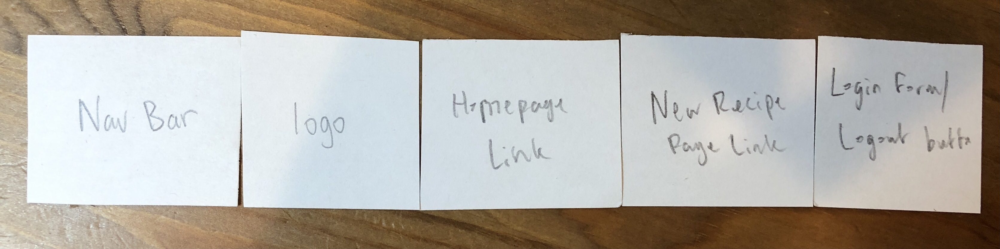

# Project 3: Design Journey

Be clear and concise in your writing. Bullets points are encouraged.

**Everything, including images, must be visible in Markdown Preview.** If it's not visible in Markdown Preview, then we won't grade it. We won't give you partial credit either. This is your warning.


## Design Plan

### Project 1 or 2
> Do you plan to reuse your Project 1 or 2 site?
> Which project?

I do not plan on using either project 1 nor 2.

> If yes, please include sketches of the site's current design (you may copy the "final" sections from those assignments.)

I am not using project 1 nor 2.


### Describe your Media Catalog (Milestone 1)
> What will your collection be about?
> What type of media will your site display? (images, videos, audio)

My collection will be about cooking recipes.

My website will display images.


### Audiences (Milestone 1)
> Briefly explain your site's audiences. Be specific and justify why each audience is appropriate for your site.
> You are required to have **two** audiences: "information consumers" and "site administrators"

Information Consumer: During the pandemic, more and more people have started to learn how to cook for themselves because a lot of restaurants have either closed or are serving at a limited capacity, so people are always looking for new recipes that they can try to cook at home. My web site will be featuring recipes for different types of food, thus the information consumer of my web site are people who are looking for new recipes that they can try to cook. The information consumers of my website are people who are old enough to cook by themselves or with adult supervision. Anyone can cook, but cooking is also very dangerous, thus the information consumers of my website are "people who are old enough to cook by themselves or with adult supervision." For example, I do not intend the information consumer of my website to be 2 year olds that are still learning how to walk, thus I included children that can cook with adult supervision as a part of my audience.

Site Administrator: The site administrators are any home cooks that would like to share a recipe that they have tried and like. They have an account on the website, and this will give them access to features such as adding a new recipe and changing their own pre-existing recipe. Being login in will also give homes cooks the ability to delete recipes that they have already created. The reason for the site administrators being home cooks is because my web site feature recipes for foods, and it would be bad if someone random just posts a random recipe that they have never even tested themselves before. This may cause many issues with the information consumers of my web site in the sense that they could in the worst case scenario poison themselves from trying a malice recipe. Home cooks on the other hand have tested the recipe and they liked the recipe, so they think that other people out in the world may also like the recipe, thus they share the recipe on my website.


### Personas (Milestone 1)
> Your personas must have a name and a "depiction". This can be a photo of a face or a drawing, etc.
> There is no required format for the persona.
> You may type out the persona below with bullet points or include an image of the persona. Just make sure it's easy to read the persona when previewing markdown.
> Your personas should focus on the goals, obstacles, and factors that influence behavior of each audience.

> Persona for your "consumer" audience:


> Persona for your "administrator" audience:


### Site Design (Milestone 1)
> Document your _entire_ design process. **We want to see iteration!**
> Show us the evolution of your design from your first idea (sketch) to the final design you plan to implement (sketch).
> Show us the process you used to organize content and plan the navigation, if applicable (card sorting).
> Plan your URLs for the site.
> Provide a brief explanation _underneath_ each design artifact. Explain what the artifact is, how it meets the goals of your personas (**refer to your personas by name**).
> Clearly label the final design.


In the first iteration of my home page, I just have a search bar so that users can easily search for a recipe if they know the name of the recipe. I also have the tags as a side bar, because I have realized that, that is a common design for other media catalog websites. The idea behind having three boxes is that when the Emily and other users like her first enter this website, there are three categories of recipes that they can pick from. After selecting a category, they will get transferred to a different web page where they will pick more specific recipes for that category. I have a "logo" on the top left of my website because that is another pattern that I have noticed with other media catalog websites like mine.


In the second iteration of my home page, I decided that I should have a navigation bar because I have more than one webpage and that prompts a navigation bar. I also moved the search bar into the main element instead of keeping it in the header because that is another pattern that I noticed with other media catalog websites.


In the third iteration of my website, I added a footer to my website because that is yet another pattern that I have noticed with other media catalog websites. I also came to realized if my users are ever having any trouble with my website, they can then more easily find my contact information and send me a email about their concerns.


In the fourth iteration of my home page, after I decided that I wanted to have a separate web page for the add new recipe form for my website, I have added a new link in the navigation bar and I have also added a login/logout button on the top right of the web site, since this was the common pattern that I saw on the other media catalog websites that I visited.


In the first iteration of my breakfast web page, I have the search bar in the header, because this was my initial sketch, tied to the first iteration of my home page (As I was sketching the first iteration of my home page, I sketch this first iteration of my breakfast web page, thus there is a lot of resemblance between this sketch and the sketch of the first iteration of my home page). I have the tags located in the aside element, which is located on the left side of my webpage. I then had the main element, which contains the different breakfast recipes.


In the second iteration of my breakfast web page, I have added the navigation bar for the different webpages and I have also moved the search bar into the main element, because that was a common design pattern that I saw on other recipe media catalog websites. The contents(recipes) are still in the same location. The logo and tags are also still in the same location on the web page.


In the third iteration of my breakfast web page, I have added a footer to this web page, because just in case my users need to reach me with any concerns, they can easily find my contact information and reach me.


In the fourth iteration of my breakfast page, I have altered the navigation bar. I have added a new link to the add new recipe page that I have decided to add. This was after I decided that the form for adding new recipes should be located on a separate web page. I have also added to login and logout button to the top right corner of the web page, because this was a common design pattern that I saw on other websites.


In the first iteration of my lunch web page, I have the header which contains only the logo and the search bar. I have the tags in a aside element that is located on the left of this web page. I have the main element to the right of the aside element, and the main element contains the lunch recipes. This is similar to the first iteration of my breakfast and first iteration of my dinner web page, because these were the first iterations of my web site. I drew them one after another, before doing a second iteration, because I wanted to sort of plan out all of my web pages before going on to refining each individual web page.


In the second iteration of my lunch web page, I have changed the header such that only the navigation bar and the "logo" resides in the header. This choice was made because I saw that on other web sites like the one that I am making that the search bar is most often placed in the "main element" or on top of the contents for the web page. This observation prompted me to make this change. I still have the aside element in the same location and the main element in the same location, because these are the common design patterns that I saw with other websites.


In the third iteration of my lunch web page, I have decided to add a footer element because this allows my users to more easily find my contact information in case they have any concerns that they want to notify me of.


In this iteration of my lunch web page, I have altered the navigation bar. I made the decision that it would be better for my users to have a separate web page where they can add a new recipe to my web site. I also added the login and logout buttons to the top right corner of my website because that is a common design that I have noticed in other recipe media catalog websites.


In this iteration of my website, I have mapped out some of the basic elements that I am going to be including on my website. I have the header, which have a "logo" and a search bar. I decided to have the search bar in the header because I though that this way my users will have no trouble at all locating the search bar because it will be the first thing that they see on the web page. I have the recipes (contents) located in a main element, which is located to the right of the aside element, which is where the tags reside.


In the second iteration of my dinner web page, I have decided to add a navigation bar because I have more than one web page, and this would allow my users to more easily more from page to page. I have also moved the search bar from in the header to into the main element, because that is a common design pattern that I noticed in other recipe media catalog websites.


In the third iteration of my website, I have included a footer so that my users can more easily reach me if they have any concerns or problems with navigating my website. This is the pattern of some of the websites that I have visited, thus I went with this pattern. This is also the pattern that Professor Harms taught us in class.


In this iteration of my website, I have changed the navigation bar, and the main reason behind the change in the navigation bar was because I realized that when I implement a login and logout feature in the future, the users that are logged in would get the special privilege of adding a new recipe. This would be useful for my content creator users because this way, home cooks like Emily can login and add new recipes that they can share with the other people that visits this website.


This is the sketch of the form for adding a new recipe on my website. The comment elements to adding a new recipe is the name of the recipe, the ingredients that are needed for the recipe, and the instructions for how to cook the dish. My form follows the slanted pattern that we learned in class in the sense that my submit button is on the bottom right corner of the form. In this form, I have the form label and inputs all aligned on the left because I though that the instructions might get long.


This is the second iteration of my form for adding a new recipe. In this iteration, I came to realize that on the desktop, there will be a lot of white space if I align the label and inputs to the left, so I decided that I would align the labels to the right and the inputs to the left. This way, there will be a lot less white space to the left and right of the web page. I also came to realize that there is also plenty of space this way for my users who are entering a very long instruction.


In this iteration of my sketch, I have removed the breakfast, lunch, and dinner links from the header, and I have also removed from the home page, boxes for breakfast lunch and dinner. For Tex Johnson, it makes more sense for him to use the tags to filter recipes by breakfast, lunch, or dinner. It does not make much sense by dividing every single recipe into breakfast, lunch and dinner, for example a dessert does not fit under these categories and that is where the tags come in. The main page now displays all of the recipes to also increase the chances in which users like Tex can encounter new recipes to try.


In this iteration, I have place the image of the recipe on top, and the information about the recipe below the image of the recipe. Tex will click on a single recipe on the main page, and then it will allow him to view the in depth information about the recipe that he clicked on.


From the first iteration, I saw that there was a lot of white space to the left and right of the image, thus in this iteration of single view of a recipe, I have place the information about the recipe to the right of the image of the recipe to reduce the amount of white space. Additionally my web site is meant to be viewed on desktop by Tex, thus it makes sense that the recipe goes to the right side of the image of the recipe. I also removed placing Emily's name and email on the website, because that is a common design pattern that I have found on recipe websites. Instead I have placed my contact information in the footer of the webpage so that if any users have any question regarding any recipes, they will first contact me, and then I will email the home cook that created the recipe and ask whether they would like their contact information shared. By removing the name and email of the homecook, I am preventing bias towards homecooks in the sense that users can not be unable to tell the race, gender, and other personal information about the recipe (incorporating idea that I have learned from INFO 1260).


This sketch shows first draft that I have for single view edit mode. I have basically place the edit form the same way that the recipe is viewed without edit mode. Emily would now be able to see the recipe as she is editing the contents of the recipe.


In this sketch, I have change the way that the edit form is displayed. I realized that if the image is wide, then Emily will only have a very narrow form and the form is thus very hard to read. In the sketch, the form is place below the image of the recipe to maximize the amount of space given to Emily such that while she is editing her recipe, she does not have a very hard time doing so.


In this sketch, I show the form Emily uses to add a new recipe. In this form, I have initially placed all of the labels on top of the form control elements. This way the form control element is easily linked to the label. In this design I also employ the slant pattern that Professor Harms taught us by putting the submit button on the bottom right side of the form.


In this sketch, I have now changed the layout of the form, because there was way to much white space to the left and to the right of the form. In order to better utilize the white space, I have aligned the labels of the form to the right side and I have aligned the form control elements of the form to the left. Now the form is aligned properly so that users do not have to move their eyes all over the website in order to fill out the form, and the form now also properly utilizes the white space. I have also included the feedback messages that would showup when the form has invalid inputs.


This is a sketch showing the message that comes up that tells users to login, in order to fill out a new recipe.


This sketch shows the message that comes up when an authorized user successfully deletes a recipe.


This sketch shows the message that appears when a new recipe is successfully inserted by users like Emily


This is a sketch that shows the 404 not found web page


In this card-sorting, I have listed all of the main contents that I plan on including in all of my web pages.


This sketch shows the seed recipe contents that goes on my home page


In this cardsorting, I show all of the information that Emily would need to fill out in order to insert a new recipe.


In this cardsorting, I show all of the tags seed data


In this cardsorting, I show all of the contents that I am going to include in my navigation bar


### Design Patterns (Milestone 1)
> Write a one paragraph reflection explaining how you used the design patterns in your site's design.

The first way that I used design patterns in my website is that I have separated my content in to header, aside, main, and footer. Through separating the pieces of contents and the locations that I am placing each piece of content, I am able to use alignment and proximity to make related content close together and unrelated content far apart. Dividing up my contents will also allow me to properly align each piece of content with respect to other contents in the same group, such that when the user is viewing the group of content, their eyes are not zig-zagging all over the web page (Professor Harms taught us that this is a major usability issue). Another thing that dividing up all of the contents allow me to accomplish is minimizing the amount of white space on my webpage. Professor Harms taught us that it is bad to have a lot of white space on our webpages because it makes our web pages feel empty. We need to utilize all of the white space, and I was able to achieve this goal by dividing up all of my content and the organizing the groups of content on my web page such that there is not a lot of white space. I was also able to use the design pattern of hierarchy in my website in the sense that sub headings of each section has a larger font compared to the contents that fall below those sub headings and this will help the users distinguish the different sections that are on my website. In the new recipe form, I have also employed the alignment design patterns that Professor Harms taught us in class to make sure that my users do not have to zig zag their eyes all over my webpage in order to fill out the form (Professor Harms taught us that making our user zig zag their eyes all over our web page poses a usability issue).


## Implementation Plan

### Requests (Milestone 1. Revise in Milestone 2)
> Identify and plan each request you will support in your design.
> List each request that you will need (e.g. view image details, view gallery, edit book, tag product, etc.)
> For each request, specify the request type (GET or POST), how you will initiate the request: (form or query string URL), and the HTTP parameters necessary for the request.

<!-- Example:
- Request: view movie details
  - Type: GET
  - URL: /movie/details?id=X
  - Params: id _or_ movie_id (movies.id in DB) -->

- Request: view all of the entries for a given tag
  - Type: GET
  - URL: /?tag=x
  - Params: tagName (tags.label in DB)

- Request: add a new tag for a recipe
  - Type: POST
  - Form
  - Params: newTag (tags.label in DB)

- Request: adding a new recipe
  - Type: POST
  - Form
  - Params: dish (recipes.dish in DB), ingredient (recipes.ingredient in DB), instruction (recipes.instruction in DB), newTag (tags.label in DB), source (recipes.source in DB), image-file(recipes.file_ext, recipes.filename in DB)

- Request: Login
  - Type: POST
  - Form
  - Params: user_name (users.username in DB), user_password (users.password in DB)

- Request: Logout
  - Type: GET
  - /?logout=
  - Params: user_id (sessions.user_id and users.id in DB), session (sessions.session in DB)

- Request: Deleting a given recipe
  - Type: POST
  - Form
  - Params: action, recipe_id (recipes.id), tag_id (tags.id), changeRecipe (recipe_tags.id)
*Note: Professor Harms noted in the project 3 write up that when we are deleting images, we should use a button, and deleting an entire recipe would include deleting the image as well, thus is makes sense to use a button to implement the deleting entry feature of this website.

- Request: Delete a tag for a given recipe
  - Type: GET
  - URL: /recipe?changeRecipe=1&action=delete_tag&recipe_id=1&tag_id=1
  - Params: action, changeRecipe (recipe_tags.id), recipe_id (recipes.id), tag_id (tags.id)

- Request: Update/Save changes
  - Type: POST
  - Form
  - Params: dish (recipes.dish in DB), ingredient (recipes.ingredient in DB), instruction (recipes.instruction in DB)


### Database Schema (Milestone 1. Revise in Milestone 2)
> Describe the structure of your database. You may use words or a picture. A bulleted list is probably the simplest way to do this. Make sure you include constraints for each field.

> Hint: You probably need a table for "entries", `tags`, `"entry"_tags` (stores relationship between entries and tags), and a `users` tables.

> Hint: For foreign keys, use the singular name of the table + _id. For example: `image_id` and `tag_id` for the `image_tags` (tags for each image) table.

<!-- Example: -->
<!-- Table: movies
- field1: TYPE {constraints...},
- field2...
- TODO -->

Table: sessions
- id: INTEGER NOT NULL PRIMARY KEY AUTOINCREMENT UNIQUE,
- user_id: INTEGER NOT NULL,
- session: session TEXT NOT NULL UNIQUE,
- last_login: TEXT NOT NULL,
- FOREIGN KEY(user_id) REFERENCES user(id)

Table: users
- id: INTEGER NOT NULL PRIMARY KEY AUTOINCREMENT UNIQUE,
- username: TEXT NOT NULL UNIQUE,
- password: password TEXT NOT NULL

Table: recipes
- id: INTEGER NOT NULL PRIMARY KEY AUTOINCREMENT UNIQUE,
- user_id: INTEGER NOT NULL,
- dish: TEXT NOT NULL UNIQUE,
- ingredient: TEXT NOT NULL,
- instruction: TEXT NOT NULL,
- filename: TEXT NOT NULL,
- file_ext: TEXT NOT NULL,
- source: TEXT,
- FOREIGN KEY(user_id) REFERENCES users(id)

Table: tags
- id: INTEGER NOT NULL PRIMARY KEY AUTOINCREMENT UNIQUE,
- label: TEXT NOT NULL UNIQUE

Table: recipe_tags
- id: INTEGER NOT NULL PRIMARY KEY AUTOINCREMENT UNIQUE,
- tag_id: INTEGER NOT NULL,
- recipe_id: INTEGER NOT NULL,
- FOREIGN KEY (recipe_id) REFERENCES recipes(id),
- FOREIGN KEY (tag_id) REFERENCES tags(id)

Table: memberships
- id INTEGER NOT NULL PRIMARY KEY AUTOINCREMENT UNIQUE,
- group_id INTEGER NOT NULL,
- user_id INTEGER NOT NULL,
- FOREIGN KEY (group_id) REFERENCES groups(id),
- FOREIGN KEY (user_id) REFERENCES users(id)

Table: groups
- id: INTEGER NOT NULL PRIMARY KEY AUTOINCREMENT UNIQUE,
- name: TEXT NOT NULL UNIQUE


### Database Query Plan (Milestone 1. Revise in Milestone 2)
> Plan your database queries. You may use natural language, pseudocode, or SQL.

1. Retrieving all records of recipes
Join recipes, tags, and recipe_tags_ table
Select all of the fields from the joined table

2. Inserting a new recipe
Make sure that the user is logged in first
Insert into new recipe name into the recipes table
Insert the ingredients into recipes table
Insert the instructions into recipes table
Insert source into recipes table
Insert tags into tags table
Insert the inserted tag id into the recipe_tags table
Insert the inserted recipe id into the recipe_tags table

4. Retrieving all of the tags
Join tags, recipes, and recipe_tags table
Select all of the fields from the joined table with the selected tag name

5. Inserting a new tag for a recipe
First make sure that the user is logged in and that the user is authorized
Check if the tag is already present in the for the recipe
If it is already present, then return the recipe already has tag error message
Else if the tag is not present for the recipe, check if the tag is already in the tags table
If it is not in the tags table, then add a new tag and then update the recipe with the tag
If it is in the tags table, add the recipe to the tag
Insert the primary keys into the entry_tags table

6. Retrieving all of the items for a given tag that the user selected
Join tags, recipes, and recipe_tags table
Select the records where tags.label is equal to the tag that the user clicked on

7. Deleting the selected recipe:
First make sure that the user is logged in and that the user is authorized
Check that the user click on the delete recipe button.
Delete the records in the recipe_tags table where the recipe_id is equal to the id of the current recipe that the user is on.
Next, delete the record in the recipes table where the recipe name matched the name of the recipe that the user have selected on to delete

8. Delete the selected tag for a recipe:
First make sure that the user is logged in and that the user is authorized
Delete the record in the recipe_tags table where the recipe_id matches the recipe id of the current recipe and the tag_id matches the tag id for the tag that the user have selected to delete from this recipe

9. Saving changes that the user have made to the existing recipe
First make sure that the user is logged in and that the user is authorized
For the recipe name, make sure that it is not empty and that the name does not already exist for another recipe
Else show the edit for feedback message
For the ingredient and instruction of the recipe make sure that the authorized user did not leave the fields blank
Else show the edit for feedback message
Else if all of the user inputs for the recipe update form is valid, then update the recipes table with the recipe name, recipe ingredient, and recipe instruction

### Code Planning (Milestone 1. Revise in Milestone 2)
> Plan any PHP code you'll need here using pseudocode.
> Use this space to plan out your form validation and assembling the SQL queries, etc.
> Tip: Break this up by pages. It makes it easier to plan.

<!-- Add a new recipe page -->
Add a new recipe page
POST Request, using a form
```
When the user submits the form:
  If the image file that the user has selected is valid:
  Hide the image file feedback message
  else:
  Show the image file feedback message (Please select an image for the recipe)
  If the recipe name data is valid:
  Hide the recipe name feedback message
  else:
  Show the recipe name feedback message (Please provide the name of the recipe)
  If the recipe name data component data is unique:
  Hide the recipe name unique feedback message
  else:
  Show the recipe name unique feedback message
  If the ingredients component data is valid:
  Hide the ingredients feedback message
  else:
  Show the ingredients feedback message (Please provide the name of the ingredients)
  If instructions component data is valid:
  Hide the instructions feedback message
  else:
  Show the instructions feedback message (Please provide the instructions for cooking the recipe)
  If the form data is valid (all of the components have valid inputs/no error messages):
  Send data(all of the inputs) to the server and store the values in the database
  else:
  Do not submit the form/send the form to the server/do not store the values of the form into the database
```

<!-- Add a new recipe page - SQL code -->
Add a new recipe page
SQL query for inserting the new recipe

```
"INSERT INTO recipes (user_id, dish, ingredient, instruction, filename, file_ext, source) VALUES (:user_id, :dish, :ingredient, :instruction, :filename, :file_ext, :source);"
array(
  ':user_id' => $current_user['id'],
  ':dish' => $upload_dishName,
  ':ingredient' => $upload_dishIngredient,
  ':instruction' => $upload_dishInstruction,
  ':filename' => $upload_filename,
  ':file_ext' => $upload_ext,
  ':source' => $upload_dishSource
)
*One thing to note here is that I have used parameter markers in order to prevent SQL injection
```

<!-- showing information about the entrie(s) -->
Homepage and detail for showing information about the entrie(s)
*One thing to note here is that on the homepage, all of the entries will be shown, while on the single entry page, only information about the single entry will be shown
Showing all of the information for each recipe
```
foreach ($records as $record) {
  ... Pick out the information needed and echo it out as HTML (*Note: need to use htmlspecialchars to echo out the information from the database for security reasons)...
}
```

<!-- Homepage - Displaying all of the tags -->
Homepage - Displaying all of the tags
Route: /
```
If the user comes to the website - the user does not have to be logged in
then execute:
  $records = exec_sql_query(
    $db,
    "SELECT * FROM recipe_tags INNER JOIN tags ON recipe_tags.tag_id=tags.id GROUP BY label;"
  )->fetchAll();
and also execute:
  foreach ($records as $record) {
    echo nl2br('<a href="/?tag=' . htmlspecialchars($record['label']) . '">' . '#' . htmlspecialchars($record['label']) . '</a>' . "\r\n");
  }
*Note: Here I am selecting all of the tags from the tags table, and then echoing out all of the tags using htmlspecialchars
*Note: I am using a foreach loop just like we were taught in class in order to print out all of the tags
```

<!-- Recipes page - showing the edit button -->
Recipes page - showing the edit button
Route GET /recipe?changeRecipe
```
if the user is logged in and the user is the owner of this recipe (is_user_logged_in() && $current_user['id'] == $recipe['user_id'])
then:
  show the edit button below the image of the recipe

if the user clicks on the edit button
then:
  show the form for this recipe where the user can modify this recipe
  also show the user the option to delete this recipe if the edit button was clicked on

if the user is logged in and the user is the owner of this recipe, but the user does not click on the edit form button
then:
  do not show the edit form, but do show the edit button below the image for this recipe
```

<!-- Recipes page - adding a new tag for the selected recipe -->
Recipes page - adding a new tag for the selected recipe
Route: POST  /recipe?changeRecipe=x (x is the recipe id for the recipe that the user have selected)
```
if the user is logged in and the user is the owner of this recipe (is_user_logged_in() && $current_user['id'] == $recipe['user_id']) and the user clicks on the edit button
then:
  show the add a new tag form for this recipe

if the user provides a valid input for a new tag (a tag that is not the empty string and this recipe does not already contain the inputted tag name) and the user clicks on the add new tag button
then:

  $recipe_id= (int)trim($_GET['changeRecipe']);

  $result = exec_sql_query(
    $db,
    "INSERT INTO tags (label) VALUES (:tag);",
    array(
      ':tag' => $add_new_tag //tainted
    )
  );

  $inserted_tag_id = $db->lastInsertId("id");

  $result = exec_sql_query(
    $db,
    "INSERT INTO recipe_tags (tag_id, recipe_id) VALUES (:tagId, :recipeId);",
    array(
      ':tagId' => $inserted_tag_id, //tainted
      ':recipeId' => $recipe_id
    )
  );
*Note: I have used parameter markers here in order to prevent SQL injection.
```

<!-- Recipes page - deleting a tag that already exist for this recipe -->
Recipes page - deleting a tag that already exist for this recipe - one note here is that each recipe must have at least one tag, thus if a recipe only has one tag then the user cannot delete that tag
Route: GET  /recipe?changeRecipe=1&action=delete_tag&recipe_id=x&tag_id=y (x and y are integers that represent the recipe id and the tag id)
```
if the user is logged in and the user is the owner of this recipe (is_user_logged_in() && $current_user['id'] == $recipe['user_id']) and the user clicks on the edit button
then:
  show the add a new tag form for this recipe

if the user clicks on the delete tag query string next to the tag, and the total number of tags for this selected recipe is greater than 1
then:
  $recipe_id= (int)trim($_GET['changeRecipe']);

  $tagID = trim($_GET['tag_id']);

  $result = exec_sql_query(
    $db,
    "DELETE FROM recipe_tags WHERE tag_id = :tagId AND recipe_id = :recipeId;",
    array(
      ':tagId' => $tagID, //tainted
      ':recipeId' => $recipe_id
    )
  );
else: - the alternate condition: (($_GET['action'] == 'delete_tag' && count($record['label']) < 1))
  $delete_error_message = True;
  *Note: This here displays the feedback message that tells the user that an error occurred during the deletion of the tag, either because the tag already existed for this recipe or the tag control form was empty, and it also ask the user to please try again
```

<!-- clicking the save button -->
Recipes page - clicking the save button to save changed to the current recipe
Route: POST  /recipe?changeRecipe=x (x is the recipe id)
```
if the user is logged in and the user is the owner of this recipe (is_user_logged_in() && $current_user['id'] == $recipe['user_id']) and the user clicks on the edit button
then:
  show the add a new tag form for this recipe

if the user clicks on the save changes button for the edit recipe form,
double check that the user is logged in and that the user is authorized and
  For the recipe name, make sure that it is not empty and that the name does not already exist for another recipe

  For the ingredient and instruction of the recipe make sure that the authorized user did not leave the fields blank

*if these conditions are satisfied, then:
  $rows = exec_sql_query (
    $db,
    "SELECT * FROM recipes WHERE (dish=:recipeName);",
    array(
      ':recipeName' => $dishName
    )
  )->fetchAll();

  exec_sql_query(
    $db,
    "UPDATE recipes SET dish = :dishName, ingredient = :recipeIngredient, instruction = :recipeInstruction WHERE (id = :recipeID);",
    array(
      'dishName' => $dishName,
      'recipeIngredient' => $ingredient,
      'recipeInstruction' => $instruction,
      'recipeID' => $recipe_id
    )
  );

  $records = exec_sql_query(
    $db,
    "SELECT * FROM recipes INNER JOIN recipe_tags ON recipes.id=recipe_tags.recipe_id INNER JOIN tags ON tags.id=recipe_tags.tag_id WHERE recipe_id = :id;",
    array(':id' => $recipe_id)
  )->fetchALL();
  $recipe= $records[0];
*Note: in the last part here, I am retrieving the updated recipe

*Note: Here is the update was unsuccessful, then I will show the feedback message telling the user that the changes made to the recipe was unsuccessful and I would also ask the users to please try again
```

<!-- deleting the recipe completely -->
Recipes page - deleting the selected recipe
Route: POST /recipe?changeRecipe=x (x is the recipe id)
```
if the user is logged in and the user is the owner of this recipe (is_user_logged_in() && $current_user['id'] == $recipe['user_id']) and the user clicks on the edit button
then:
  show the add a new tag form for this recipe

if the user clicks on the delete recipe query string
then:
  double check that the user is logged in and that the user is authorized and:

  $result = exec_sql_query(
    $db,
    "DELETE FROM recipe_tags WHERE recipe_id = :recipeId;",
    array(
      ':recipeId' => $recipe_id
    )
  );

  $result = exec_sql_query(
    $db,
    "DELETE FROM recipes WHERE dish = :dishName",
    array(
      ':dishName' => $recipe['dish'], //tainted
    )
  );

  $recipeFilePath = 'public/uploads/recipes/' . $recipe['recipe_id'] . '.' . $recipe['file_ext'];

  unlink($recipeFilePath);
*Note: The last part here is to delete the image that sits inside of the uploads folder inside of the repository, this is because I need to clean up any references to this recipe that was deleted
```

## Submission

### Audience (Final Submission)
> Tell us how your final site meets the needs of the audiences. Be specific here. Tell us how you tailored your design, content, etc. to make your website usable for your personas. Refer to the personas by name.
For Tex Johnson, I have included the ingredients so that he can look up the prices of the ingredients. I did not specifically included the prices of each of the ingredients because the prices fluctuate over time and I do not want to mislead Tex when he is planning out his meals for his family. This will help him decide what meals he should make for his family. Tex needed to be able to feed his entire family and I have included many recipes Tex can cook a variety of meals for his kids and wife. Tex wanted to cook nutritious meals for his family, and I was able to meet this need in the sense that each recipe lists ingredients for the recipe, thus Tex can evaluate which recipes he feel would be more healthy for his family. Tex wanted to spend quality dinner time together with his family and I was able to meet this need of his because with the surplus of recipes on my website, Tex can cook nutritious meals for his entire family during dinner time so that everyone comes together to eat together. Tex also wanted to teach his kids how to cook, and I was able to meet this need to his because with my website, Tex can now teach his kids how to read and follow recipes. Tex can also find recipes that are simple to cook, so that even his kids are able to help out in the kitchen. Tex's kids are at home due to the pandemic and Tex need to make them breakfast and I was able to meet this need of his because there is a tag for breakfast recipes that Tex can click on to find breakfast recipes that he can cook for his kids. I was able to meet the need of Emily because she is a homecook that need a place where she can share her recipes with others during the pandemic. Emily loves to help others, especially during a tough time like the pandemic and she hopes to bring other joy through her recipe. On my website, Emily would now be able to share her recipe with others. Emily has always wanted to teach others how to cook, and by assembling her recipe on my web site and sharing it with other, her need of wanting to teach others how to cook is met. Emily also does not have fast internet connection at home, and I was able to meet this need of hers because my website is nice and simple, and it is not crowded with large files. This makes my website more usable for Emily because now she does not have to worry about struggling to load my website.


### Additional Design Justifications (Final Submission)
> If you feel like you haven’t fully explained your design choices in the final submission, or you want to explain some functions in your site (e.g., if you feel like you make a special design choice which might not meet the final requirement), you can use the additional design justifications to justify your design choices. Remember, this is place for you to justify your design choices which you haven’t covered in the design journey. You don’t need to fill out this section if you think all design choices have been well explained in the design journey.

One thing to note here is that for my website, I have made the design decision that each recipe must have at least one tag, so when a user selects on a recipe, and they are authorized to edit the recipe (meaning that they created this recipe) then they, and when they click on the query string for deleting a tag, if the recipe only has one tag, the tag will not delete because each recipe must have at least one tag. In my implementation, a error message will show up telling the user that this recipe has to have at least 2 tags before they can delete a tag, because each recipe must have at least one tag. Once the user have provided more tags (when there are more than 1 tag for a given recipe) then they can delete a tag. I made this design decision because users like Emily can then easily group the recipes that they have created together. In fact, they can even use their name as a tag if that makes organizing their recipes easily. In the write up for this assignment, Professor Harms noted that we should not be using submit buttons everywhere, especially with the fact that web sites nowadays are not littered with submit buttons, but he did mention that we will need to use a delete button in order to delete the entry (not just the tag), because we are going to be deleting the image for the entry. In my case, it will be deleting the entry of an entire recipe. I have placed a warning telling the user that clicking on the delete button to delete the selected recipe is a permanent action and it cannot be undone. This warning message replaces the confirmation message that pops up asking the user whether they would like to delete this recipe. I decided to implement this instead of the confirmation page, because when a user like Emily is set on deleting a recipe and they have to click on the confirmation button, this can be slow and tedious. Emily has slow internet connect, thus with the warning message instead of the pop up message Emily can ensure that she is able to smoothly delete a recipe when she desires to do so without having to worry about her internet connection, because she does not have to go through the slow process of clicking delete, and then again clicking confirm delete. At the same time, the warning message will give Emily a sense of what is going to happen when she click on the delete button for deleting her recipe.


### Self-Reflection (Final Submission)
> Reflect on what you learned during this assignment. How have you improved from Project 1? What things did you have trouble with?

I have learned so much during this assignment. The first thing that I learned during this assignment is how to implement the tagging system. This was a lot different from project one in the sense that during project one I was still using check boxes. In project one, we have yet to learn about query string parameter and I would not have been able to implement the tagging system with my knowledge solely up to the point of project one. Another thing that I learned during this assignment is how to do file upload. During project one, I was able to implement server side validation of forms, but it was just with fields such as text fields, number fields, checkboxes, drop down menus, text areas, and radio buttons. I have yet to learn how to implement file upload, nor did I know how to use server side validation to make sure that the file upload was of the file that should be allowed for my website. In general, I have no idea how to implement a media gallery prior to this assignment. Before I started this assignment, I was actually very skeptical that I would be able to successfully implement the media gallery because it seemed so out of scope, but through the many hours spent on code and even more hours spent on debugging I was glad that I was able to get everything to work out in the end. I had a lot of trouble with implementing the tags, because it was best practice to not use forms or check boxes to implement the tagging, but those are the methods that I was familiar with. I was clueless as to how I was able to get started, but after re-watching the query string parameter lesson many times over and asking questions from TAs, I was able to figure out how to implement tagging using query string parameters. In general I have improved so much from project 1 just in the sense that I was able to even implement a media gallery.


### Grading: Mobile or Desktop (Final Submission)
> When we grade your final site, should we grade this with a mobile screen size or a desktop screen size?

Desktop screen size please.


### Grading: Step-by-Step Instructions (Final Submission)
> Write step-by-step instructions for the graders.
> The project if very hard to grade if we don't understand how your site works.
> For example, you must login before you can delete.
> For each set of instructions, assume the grader is starting from /

Viewing all entries:
1. You can view all entries without logging in
2. Use the homepage url to view all entries ("/")

View all entries for a tag:
1. On the right side of the homepage there is the tag section
2. Click on the tag for which you want to view all entries

View a single entry and all the tags for that entry:
1. Select the recipe that you would want to view a single entry for by clicking on the recipe (the image)
2. On the right side of the new webpage, underneath the instructions for the recipe is all of the tags for that recipe

How to insert and upload a new entry:
1. You will first need to login before uploading a new recipe
2. In the navigation bar click on "Add New Recipe" link
3. Select an image for the recipe
4. Fill name of the recipe
5. Fill in the ingredients for the recipe
6. Fill in the instructions for the recipe
7. Give the recipe a tag
8. Give the recipe a source if it was not create by you(grader)
9. Click the submit button

How to delete an entry:
1. Use the recipe_tags table, and the recipes table to locate which recipe belongs to which homecook
2. Login in as that homecook(user)
3. Select the recipe that is made by that homecook
4. Click on the delete link beneath the image of the recipe on the single entry page
5. The form version of the webpage will popup
6. Next click on the delete button to delete the given recipe

How to view all tags at once:
1. The homepage has all of the tags, no login necessary

How to add a tag to an existing entry:
1. Use the recipe_tags table, and the recipes table to locate which recipe belongs to which homecook
2. Login in as that homecook(user)
3. Select the recipe that is made by that homecook
4. Click on the edit link beneath the image of the recipe on the single entry page
5. Below the existing tag portion of the web page, there is a form single component form for adding a new tag.
6. Type a tag name and click the add new tag button.

How to remove a tag from an existing entry:
1. Use the recipe_tags table, and the recipes table to locate which recipe belongs to which homecook
2. Login in as that homecook(user)
3. Select the recipe that is made by that homecook
4. Click on the edit link beneath the image of the recipe on the single entry page
5. There are remove links next to each tag
6. Click on the remove link to remove the tag from the existing entry.
